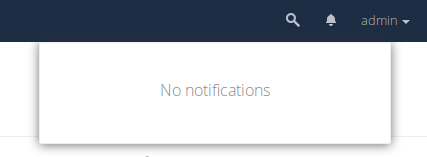
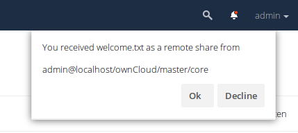

# Notifications

An app that notifies the user about important events of other apps.

## QA metrics on master branch:

## Screenshots

### No notifications (Sample)

**Note:**
The app hides itself, when there is no app registered, that creates
notifications. In this case the bell and the dropdown are not accessible.

### New notifications (Sample)

## Notification workflow

For information how to make your app interact with the notifications app, see
[Sending and processing/"mark as read" notifications as an Nextcloud App](https://github.com/nextcloud/notifications/blob/master/docs/notification-workflow.md)
in the wiki.

If you want to present notifications as a client, see [Reading and deleting notifications as an Nextcloud Client](https://github.com/nextcloud/notifications/blob/master/docs/ocs-endpoint-v1.md).
